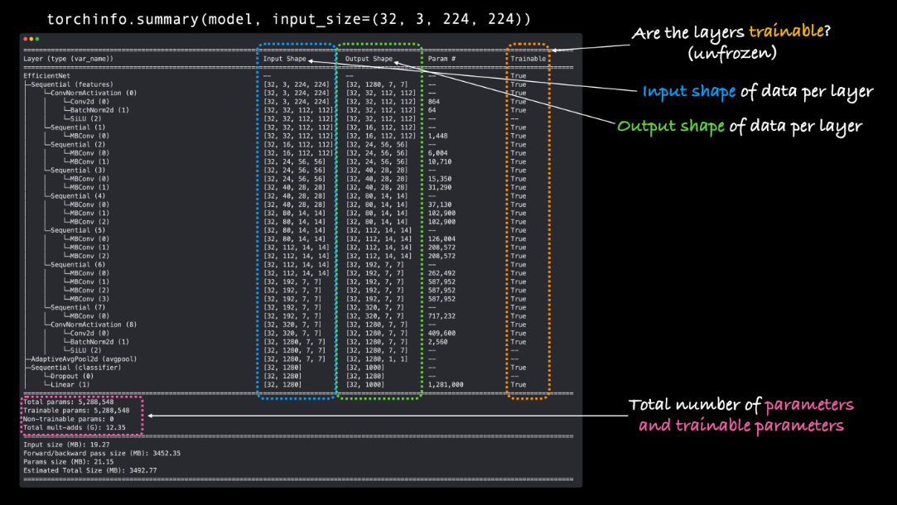

acuan:
- https://docs.pytorch.org/vision/main/models.html
setup pretrained model

model:
Model	                  Pretrained Weights Available
EfficientNet V1 (B0–B7)	  IMAGENET1K_V1
ResNet, RegNet, MobileNet IMAGENET1K_V2
EfficientNet V2 (model)   IMAGENET1K_V1

EficientNetB0:
